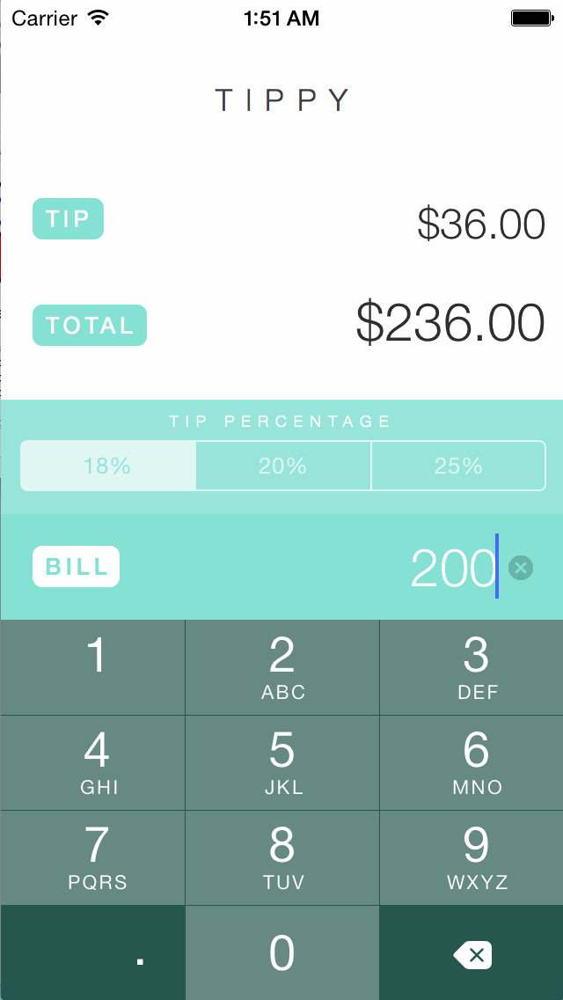

# Tip Calculator - CodePath Prework

This is a tip calculator demo application for the CodePath iOS course prework. It allows the simple calculation of your tip and total based on the bill total.

Time spent: 4 hours spent in total
 
Notes:

Followed all instructions from the video walkthrough
Spent some time designing a simple UI and setting UIView background image

Walkthrough of all user stories:

GIF created with [LiceCap](http://www.cockos.com/licecap/).